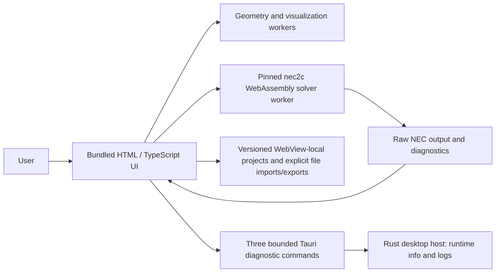

# HF Antenna Studio — Architecture

Status: v1.0.0 implemented architecture plus unreleased post-v1 ground-radial extension
Last reviewed: 2026-08-25

## Recommendation in one sentence

Ship v1.0.0 as a GPL-3.0-or-later Tauri 2/WebView2 desktop application containing the React/TypeScript UI and pinned nec2c/WebAssembly NEC-2 solver in a dedicated cancellable worker; keep the canonical model/adapter boundary so a future native or alternative solver can be evaluated without changing antenna semantics.

This release decision is D-031. The exact v1 Wasm path passes the bounded application/reference suite and Windows installed/offline package gate; those results do not validate every antenna or NEC assumption. The native-process design below is retained as a post-v1 alternative, not the current runtime.

## Implementation lineage and evidence checkpoints

The `feature/verified-dipole-model` branch first implemented a deliberately narrow vertical slice inside the inherited AntennaSim browser/Wasm baseline. Its typed SI model, dedicated NEC adapter, exact-deck worker request, result validator, and `/verified-dipole` page established the contract shape later retained in v1. At that checkpoint it did not select a product runtime; D-031 made the later selection after the broader evidence campaign.

The key architectural evidence is that the displayed deterministic deck crosses a narrow solver boundary without being rebuilt from a second application model. That pattern is retained in the shared TypeScript domain, NEC-adapter, parser, and solver-service modules. See [`VERIFIED_DIPOLE.md`](VERIFIED_DIPOLE.md) for implementation and validation boundaries.

The `feature/antenna-template-system` branch extended that experiment with a declarative template registry, an SI-only shared parametric-wire schema, and one common workbench/segmentation/NEC pipeline for eight antenna topologies. It demonstrates that adding a template need not add a calculation screen and is part of the Tauri/Wasm v1 codebase. See [`ANTENNA_TEMPLATE_SYSTEM.md`](ANTENNA_TEMPLATE_SYSTEM.md) for the contract, RF review, regression evidence, and open validation work.

The `feature/vertical-antennas` branch added a solver-independent vertical-model schema and a dedicated NEC adapter for three intentionally non-equivalent configurations. The post-v1 `feature/ground-radial-systems` branch adds a fourth: horizontal explicit radial wires held at visible positive clearance over Sommerfeld/Norton ground. It also adds independent or explicitly bonded shared near-surface radial topologies to phased vertical arrays. Exact model identity continues across generated deck, result, and UI; incompatible ground, contact, droop and crossing combinations are rejected before execution. Separate 4NEC2 NEC-2D same-deck checks cover the original 40/20/10-m perfect-ground fixtures and three new 20-m real-ground radial fixtures. This establishes cross-build agreement for those exact discretisations, not buried-wire, soil-interface or broad finite-ground accuracy. See [`VERTICAL_ANTENNAS.md`](VERTICAL_ANTENNAS.md) and [`GROUND_RADIAL_SYSTEMS.md`](GROUND_RADIAL_SYSTEMS.md).

The `feature/yagi-beam-models` branch adds a typed directional-array model and dedicated adapter for 2-to-8-element Yagis. It fixes intended forward at `+Y`, derives axial front-to-back separately from worst-rear-hemisphere front-to-rear, and carries exact model identity through a debounced/cancellable worker and four saved comparisons. An external NEC-2D run exposed and drove correction of an 80-column input portability issue; three exact perfect-ground decks now agree across the Wasm and external NEC-2D builds. See [`YAGI_BEAMS.md`](YAGI_BEAMS.md).

The loop/compact-beam workflow adds discriminated SI models and one dedicated adapter for closed polygon loops, multi-element closed-loop arrays, and the corrected single-band G3TXQ broadband Hexbeam wire topology. It demonstrates topology-specific connectivity contracts, explicit one-segment source bridges, derived feed orientation without a polarisation claim, non-conducting visual supports, and the reuse of D-019's forward-axis metrics. Five perfect-ground decks agree with the separate NEC-2D comparator; physical/reference and finite-ground validation remain open. Its domain/generator/adapter/result separation is retained under `frontend/src/features/loop-beams/`. See [`LOOP_AND_HEXBEAM_MODELS.md`](LOOP_AND_HEXBEAM_MODELS.md).

The `feature/phased-arrays` branch adds a two-element phased-vertical domain and deliberately separate ideal-current and physical-network solver paths. Ideal mode derives a coupled two-port admittance matrix from two NEC calibration runs, solves the complex `EX` voltages required for requested feed currents, and verifies the final currents before accepting a pattern. Physical mode uses one source junction and explicit ideal `TL` cards, with solved element currents as outputs. Both paths share exact model identity, debounce/cancellation, bounded caches, compass-pattern metrics, and immutable overlays. Three classic perfect-ground decks pass a separate NEC-2D comparison; physical TL, finite-ground, radial, and convergence validation remain open. See [`PHASED_ARRAYS.md`](PHASED_ARRAYS.md).

The `feature/frequency-analyser` branch adds an impedance-only client of the same exact-deck worker boundary. One linear `FR` batch followed by `XQ` returns parsed feed impedances without generating radiation grids or currents. A later shared results-view extension keeps that efficient batch and runs one separate cancellable full-pattern deck for the selected frequency so the analyser can present the same paired azimuth/elevation cuts as other model workspaces. Match quantities are pure, tested functions of complex impedance and a visible real reference impedance; cancellation and exact job identity prevent stale publication. Its versioned export snapshots both antenna request and completed sweep results, but analyser import and arbitrary Wire Editor input remain deferred. See [`FREQUENCY_ANALYSER.md`](FREQUENCY_ANALYSER.md).

The `feature/current-visualisation` branch makes parsed complex segment currents a shared view contract. Generic scenes consume `SegmentCurrent[]` directly, while specialist validators retain the parser's XYZ/magnitude/phase fields and adapt them without generating samples. One shared renderer provides magnitude, phase, combined, and slowed phasor-time modes plus exact segment inspection. It removes the inherited whole-wire average-flow metaphor. This is renderer-lineage evidence, not independent numerical validation of current values. See [`CURRENT_VISUALISATION.md`](CURRENT_VISUALISATION.md).

The `feature/model-comparison` branch adds a four-slot result consumer over existing family models/adapters rather than another NEC compiler. One immutable condition identity covers frequency, ground constants/formulation, reference impedance, exact common cut planes, and sweep settings. Only current model/condition identities enter overlays; full grids are cut on the common 10-degree subset and transformed to compass coordinates at the view boundary. Single-port pattern decks are mechanically converted to batched `FR`/`XQ` impedance runs, while ideal two-port current excitation remains explicitly without a single input impedance. See [`MODEL_COMPARISON.md`](MODEL_COMPARISON.md).

The `feature/parameter-sweeps` branch adds a bounded orchestration layer over the same family model/adapter/service contracts. Inclusive 1D lines and rectangular 2D grids generate one exact typed model per coordinate, validate the coordinate against that model, execute sequentially in the existing worker boundary, and retain full model/deck provenance. A session-only 192-entry exact-model LRU cache, abort propagation, 81-job ceiling, stale-definition gating, and versioned JSON evidence prevent the sweep view from becoming a second compiler or an unbounded job system. See [`PARAMETER_SWEEPS.md`](PARAMETER_SWEEPS.md).

The `feature/antenna-optimiser` branch adds a deterministic bounded coordinate-pattern-search consumer over the same exact-model and family-service boundary. It scores but never changes solver results, rejects invalid/constrained candidates, caps work at 121 unique evaluations, publishes only an atomically complete run, and retains complete definition/history/model/deck evidence plus up to five feasible best-found candidates. It is an experimental contract prototype, not completion of the Phase 7 validation gates or a globally convergent solver. See [`ANTENNA_OPTIMISER.md`](ANTENNA_OPTIMISER.md).

The `feature/measurement-comparison` branch adds an untrusted-file boundary and comparison consumer over the frequency-analyser service. A bounded one-port Touchstone parser retains complete UTF-8 source/line provenance, derives S11/SWR/impedance without repairing input, and rejects ambiguous NanoVNA CSV. Exact matching or labelled simulation-only R/X interpolation creates comparison rows; measurement samples are never resampled or passed into NEC. Reference-impedance mismatches suppress SWR differences, and stale simulation identity remains visible. See [`MEASUREMENT_COMPARISON.md`](MEASUREMENT_COMPARISON.md).

The validation campaign adds a versioned, SHA-256-pinned manifest and fail-closed Windows runner around exact-deck family comparators. Nine primary cases cover all eight required families and 16 application-authored decks are rerun by a separate 4NEC2 NEC-2D build. This supports D-031's bounded v1 selection while retaining the important limitation that most comparisons share NEC-2 ancestry and finite-ground/convergence evidence remains open. See [`VALIDATION_REPORT.md`](VALIDATION_REPORT.md) and D-029/D-031.

The Windows package is the implemented v1 runtime. A per-user NSIS installer embeds the static UI and rebuilt pinned solver, uses Windows 11 Evergreen WebView2 with an embedded bootstrapper/check, exposes only three bounded diagnostic commands, applies a local-only CSP, preserves user data on uninstall, and is exercised after installation by real offline solver runs on a clean Windows runner. The frozen v1 gate used the verified dipole; the post-v1 radial branch configures that gate to additionally exercise explicit single-vertical and shared phased-array real-ground models and return to the start screen. Its browser-equivalent offline checks pass, while the native installed-app rerun remains pending on the Windows Rust/NSIS build host. An explicit larger offline-WebView2 configuration remains unclaimed pending air-gapped testing. See [`WINDOWS_PACKAGING.md`](WINDOWS_PACKAGING.md) and D-030/D-031.

## Why a desktop web architecture

The product requires an HTML/JavaScript interface, offline operation after installation, private local files, and dependable local calculation on Windows 11. A desktop webview provides the desired UI technology without introducing a loopback web server, Docker, Redis, or a permanently listening port.

[Tauri 2's Windows installer documentation](https://v2.tauri.app/distribute/windows-installer/) describes WebView2 bootstrapper, embedded offline installer, and fixed-runtime options. V1 selects the small bootstrapper/check package for normal Windows 11 and tests normal operation offline after installation; it does not claim fully disconnected installation on a stripped image. [Tauri capabilities](https://v2.tauri.app/security/capabilities/) provide a way to expose a deliberately small native command surface to the frontend.

Tauri is a packaging and isolation choice, not a source of numerical correctness. The nec2c Wasm module remains a separately identifiable, reproducibly built solver artifact with corresponding source.

## System context



No network component appears in the required path. The initial application will have no HTTP listener and no remote calculation endpoint.

## Architectural principles

1. **One canonical model.** Project data, NEC generation, solver results, and UI plots use versioned contracts rather than parallel Python and TypeScript interpretations.
2. **A replaceable solver boundary.** Solver selection is an adapter and release-manifest decision. UI components do not parse a solver's text directly.
3. **Raw evidence is retained where the workflow exposes it.** Generated input, raw output/diagnostics, timing, and solver identity remain available to validation paths; native-only stderr/exit fields are requirements for a future native adapter, not invented v1 data.
4. **No silent degradation.** Unsupported NEC cards or unsafe conversions are explicit diagnostics; they are never silently discarded or clamped.
5. **Coordinates and units are explicit.** SI units and NEC angular conventions are canonical; UI units and compass views are reversible transforms.
6. **Offline/private is enforced, not advertised only.** Assets are bundled, normal calculation has no network dependency, and the installed application is tested with networking forced offline. Fully disconnected installation remains a separate unvalidated package claim.
7. **Optimization is a client of a validated run API.** It cannot bypass constraints, provenance, cancellation, or validation.

## Runtime components

### Desktop host

The v1 host reports runtime/package paths, appends bounded diagnostics, and opens the resolved log directory. It does not launch the solver, expose a general filesystem API, or listen on a port. Solver jobs execute synchronously inside replaceable Web Workers; cancelling or superseding a job terminates the worker and immutable request identity prevents stale publication.

### Post-v1 native solver-host option

Responsibilities:

- start and stop bounded solver jobs without invoking a shell;
- create a unique per-job temporary directory;
- validate input size, requested output size, frequency count, and allowed solver options;
- write the NEC deck as deterministic ASCII or a documented solver-compatible encoding;
- invoke the exact bundled executable with an argument array;
- enforce timeout and cancellation, terminating the process tree safely on Windows;
- capture stdout, stderr, output file, exit code, duration, and exceptional termination;
- calculate hashes and attach build/version provenance;
- mediate user-approved open/save dialogs and atomic file replacement;
- clean temporary files under a documented policy;
- expose only the commands needed by the UI.

The default native call is expected to resemble:

```text
<bundled-solver.exe> -i <job-directory/input.nec> -o <job-directory/output.out>
```

The actual executable, flags, and output contract remain conditional on the Phase 0 solver decision. Paths are passed as separate arguments; `cmd.exe`, PowerShell, and `shell=true` are prohibited.

The host should not interpret electromagnetic values. It manages trusted installation artifacts, untrusted project input, process lifecycle, and local files.

### Canonical domain and schema

The canonical project contract includes:

- schema identifier and semantic schema version;
- document UUID, timestamps, title, notes, and application provenance;
- explicit unit declarations at interchange boundaries;
- geometry primitives with stable identifiers;
- connectivity/junction intent rather than coordinate proximity alone;
- sources, loads, transmission lines, ground, frequencies, pattern requests, and current-output requests;
- named parameters and expressions only after a deterministic expression language is specified;
- preserved imported NEC text/card representation and import diagnostics;
- optional result references keyed by immutable run identity.

Runtime validation is required when crossing file, worker, or native IPC boundaries. TypeScript static types alone are insufficient for saved or imported data.

The initial native project format should be a human-inspectable UTF-8 JSON file with an `.hfas` extension and registered media type when one is assigned. Large cached result arrays may be optional or stored in an adjacent content-addressed cache. A zip container is deferred until there is a demonstrated need; introducing it early makes inspection and recovery harder.

Migrations are one-way functions between explicit schema versions. Loading a newer unknown version is a visible error. Saving an older imported version requires user confirmation and never overwrites the original until an atomic write succeeds.

Implementation checkpoint (extended 2026-08-25): the browser-local contract covers the Template Simulator, Wire Editor, Model Comparison, Parameter Sweeps, and Antenna Optimiser. Schema v5 persists explicit simulator sweep intent plus the three engineering-workflow input definitions and radial identity; schemas 1-4 migrate on detached copies with a visible report. Named records use atomic collection replacement and optimistic revisions, and a separate recovery journal is flushed on a bounded interval and page lifecycle events. See `PROJECT_FILE_FORMAT.md`. This does not yet satisfy the packaged-host filesystem, run-manifest, complete runtime-schema, oversized-input, or Windows path/encoding gates.

### NEC document model and compiler

There are two related representations:

- **Structured model:** the editable HF Antenna Studio subset with typed geometry and control data.
- **NEC document:** ordered cards, comments, source locations, original spelling, and unsupported-card nodes.

Import produces a NEC document first. Conversion to a structured model returns a report containing supported, preserved-only, approximated, conflicting, and rejected constructs. The original deck remains available. Export from structured mode is deterministic; export from raw mode preserves cards unless the user explicitly applies a transformation.

Preservation does not imply permission to execute every card. Raw execution passes through a published solver-dialect and safety policy. Cards that can chain files, request unsupported resources, exceed job limits, or otherwise fall outside the audited executable subset are retained but blocked from execution with a diagnostic.

The model-to-deck compiler is a single library used for all runs and exports. It owns card order, numeric formatting, tag/segment mapping, solver dialect, frequency expansion, and requested-output cards. A second backend implementation is not allowed.

An intermediate run manifest records:

```text
model schema + canonical model hash
compiler version + dialect
exact generated deck + deck hash
solver id/version/binary hash/build options
requested outputs + safety limits
```

### Solver adapter contract

The host exposes a backend-independent job interface conceptually equivalent to:

```ts
type SolverRunRequest = {
  requestId: string;
  deck: string;
  deckSha256: string;
  limits: RunLimits;
};

type SolverRunResult = {
  requestId: string;
  status: "completed" | "cancelled" | "timed-out" | "failed";
  solver: SolverIdentity;
  process: ProcessEvidence;
  rawOutput?: string;
  diagnostics: Diagnostic[];
};
```

Structured electromagnetic parsing occurs in one versioned parser library after the raw run returns. The parsed result contains frequency-indexed impedance, pattern samples, current samples, power data where available, source/load references, parse diagnostics, and units. The parser never fabricates an empty successful result from missing sections.

Adapters initially considered:

- native `nec2c` command line — preferred baseline, pending acceptance;
- native NEC2++ command line/library wrapper — active challenger;
- `nec2c` WebAssembly — deferred optional adapter;
- another legally distributable native NEC executable — supported by the boundary, but not chosen.

### Job management and concurrency

The UI submits immutable jobs. A bounded queue prevents an accidental fine sweep or optimizer from exhausting CPU, memory, or disk. Each job supports progress where the solver makes it observable, cancellation, timeout, and a maximum output budget.

The first release runs one nec2c/Wasm solver worker job at a time per workbench until reentrancy, thermal behaviour, and memory use are measured. UI geometry and chart workers may run concurrently. Later optimisers may use a measured concurrency limit, but every candidate remains an ordinary solver job through the same validated pipeline. A future native runner would add process and disk measurements before selection.

Cache identity is a hash of the exact deck, solver binary/build identity, parser version, and relevant run options. A cache keyed only by project name or frequency is invalid.

### Geometry and visualization

The geometry view and result plots consume normalized view models, never raw solver rows.

Canonical geometry coordinates:

- right-handed Cartesian metres;
- +Z is up;
- NEC theta is degrees from +Z;
- NEC phi is degrees counter-clockwise in the XY plane from +X, subject to confirmation against the selected implementation;
- compass bearing/elevation are UI transforms shown in labels and legends.

The 3D radiation view must state its radial mapping. The proposed engineering default is normalized field-amplitude radius `10^(dB/20)`. A normalized power-value radius `10^(dB/10)` or a linear interpolation of dB into radius may be selectable only when clearly labelled; these produce different shapes and must not be presented as interchangeable.

Azimuth means a stated constant-theta or constant-elevation cut; elevation means a stated constant-phi/bearing plane. A global-maximum row is not automatically an azimuth cut. Asymmetric validation models will exercise handedness, bearing labels, front/back direction, and pattern seams.

Current display binds complex current samples to stable segment identifiers. Magnitude units, phase reference, phase wrapping, interpolation, and any normalization are visible. Rendering a colored wire is not evidence that the correct segment data was selected.

### Diagnostics and validity rules

Diagnostics have origin, stable code, severity, message, affected entity/card, frequency if applicable, and supporting values. Origins include:

- schema/import;
- model-to-NEC compiler;
- application validity rules;
- solver stdout/stderr/output;
- result parser;
- convergence/validation checks.

Application checks will be traceable to a solver manual or project rule and distinguish errors from cautious heuristics. Examples include zero-length wires, source segment out of range, duplicate tags, segment-length/radius ratios, segment length relative to wavelength, dissimilar adjacent radii, ground penetration/contact, close parallel wires, source/load conflicts, insufficient pattern resolution, and non-converged segmentation studies.

Raw solver warnings are retained even when an application diagnostic covers the same issue.

## Offline and Windows 11 design

- Bundle all JavaScript, styles, fonts, icons, schemas, help, and solver artifacts in the installer.
- Use the small WebView2 bootstrapper package for ordinary Windows 11 installation and prove normal operation offline after installation. Reserve the larger offline-installer/fixed-runtime option for a future air-gapped-install claim.
- Build and test x64 first. ARM64 is a separate target only after its solver and runtime pass the same suite.
- Sign the application and solver binaries when release infrastructure is available; publish SHA-256 checksums and an SBOM.
- Use Windows-safe path and process APIs, including spaces, non-ASCII paths, long paths within documented limits, and cancellation of child process trees.
- Store preferences in the documented per-user application-data directory. Store designs only at user-selected paths.
- Apply a restrictive content security policy and Tauri capability allowlist. Do not expose arbitrary command execution or arbitrary filesystem access to web content.
- Make no ordinary-use network requests. An instrumented test verifies this claim before release.
- Test installation and use in a clean, disconnected Windows 11 virtual machine and with representative endpoint security enabled.

## Security and privacy boundaries

NEC and project files are untrusted input. Parsers require length limits, finite-number checks, bounded array allocation, and diagnostics for malformed records. The solver runs as the current user, in a unique working directory, with no shell and no inherited secrets intentionally added to its environment. The host limits input and output sizes and treats a crash as a failed result, not a recoverable partial success.

The bundled webview may load only application assets. Links to external documentation open only after an explicit user action and are not required for help content. There is no listening service, remote content, telemetry, or project upload in the initial architecture.

## Proposed repository structure

```text
HF-Antenna-Studio/
├── .github/
│   ├── ISSUE_TEMPLATE/
│   └── workflows/
│       ├── ci.yml
│       ├── validation.yml
│       └── release-windows.yml
├── apps/
│   └── desktop/
│       ├── src/                    # React/TypeScript UI
│       ├── src-tauri/              # Rust host, capabilities, packaging
│       └── public/                 # bundled local-only static assets
├── packages/
│   ├── domain/                     # canonical schema, units, migrations
│   ├── nec-document/               # loss-aware NEC lexer/parser/AST
│   ├── nec-compiler/               # structured model -> deterministic deck
│   ├── result-parser/              # raw solver output -> result contract
│   ├── diagnostics/                # validity rules and warning catalogue
│   ├── coordinates/                # NEC/UI coordinate transformations
│   ├── charts/                     # tested 2D presentation components
│   ├── geometry-view/              # interactive geometry renderer
│   └── pattern-view/               # tested 3D radiation renderer
├── crates/
│   ├── desktop-commands/           # narrow Tauri IPC commands
│   ├── solver-runner/              # process isolation, timeout, cancellation
│   └── project-io/                 # safe dialogs and atomic local persistence
├── solver/
│   ├── adapters/                   # adapter manifests/configuration
│   ├── patches/                    # documented, minimal upstream patches
│   ├── provenance/                 # source commits, build recipes, hashes
│   └── README.md                   # how binaries are obtained/reproduced
├── validation/
│   ├── corpus/
│   │   ├── nec-reference/          # traceable published/reference decks
│   │   ├── analytic-sanity/        # cases with bounded expectations
│   │   ├── convergence/            # segmentation/refinement families
│   │   ├── interop/                # import/export compatibility cases
│   │   └── invalid/                # required warning/error cases
│   ├── external-results/           # licensed/traceable comparator outputs
│   ├── manifests/                  # provenance and expected metrics
│   ├── tooling/                    # comparison/report generators
│   └── reports/                    # generated evidence, not hand-edited truth
├── docs/
│   ├── adr/                        # future one-file architecture decisions
│   ├── user/                       # offline user/model-validity help
│   └── *.md                        # planning documents
├── licenses/                       # third-party license texts and notices
├── scripts/                        # reproducible build and release helpers
├── SECURITY.md
├── CONTRIBUTING.md
├── LICENSE
└── README.md
```

The tree remains a proposed destination. The experimental verified-dipole components currently live under the inherited `frontend/src/features/verified-dipole/` structure and provide migration evidence; they are not the proposed package tree.

## Implemented UI-workbench checkpoint

The inherited browser baseline now has an original Windows-first Simulator shell with four explicit regions: typed/model inputs, a flexible interactive geometry viewport, calculated key values, and detailed analysis tabs. Bounded resizers, collapse controls, status provenance, keyboard operation, responsive single-viewer selection, and light/dark design tokens are reusable UI infrastructure under `frontend/src/components/workspace/`. This checkpoint intentionally leaves electromagnetic contracts unchanged and does not replace the proposed packaged desktop/solver architecture below. See `docs/UI_OVERHAUL.md` and D-028.

## Reuse assessment from AntennaSim

The audited AntennaSim snapshot is commit [`96e153ceefffd25819e42142d591ca811b4790d3`](https://github.com/EA1FUO/AntennaSim/tree/96e153ceefffd25819e42142d591ca811b4790d3), reviewed on 2026-08-02.

Potentially reusable with GPL attribution and correctness tests:

- React/TypeScript interaction patterns and editor state concepts;
- wire geometry, junction, measurement, and camera-control concepts;
- project migration and template concepts;
- chart and Three.js component structure after coordinate/result verification;
- Web Worker isolation pattern;
- matching-network calculation utilities after unit tests;
- parser fixture organization and model-building tests.

Do not transplant without redesign:

- duplicated Python and TypeScript model/deck/output implementations;
- silent/clamping NEC import behavior;
- solver warning handling;
- current frequency/pattern-domain assumptions;
- derived efficiency and beamwidth calculations;
- Docker/Redis/FastAPI deployment as the primary Windows architecture;
- a project schema that omits raw-card and solver provenance;
- claims that backend and Wasm results are identical without evidence.

Do not copy proprietary third-party assets or AntennaSim branding. Any copied or adapted AntennaSim file must retain its applicable copyright/license notices and record the source commit in a provenance manifest.

## Technical debt identified in the foundation candidate

The following findings affect reuse decisions; they are observations of the audited snapshot, not assertions that every visible feature is wrong:

- Backend and browser paths independently build decks and parse results, making drift possible.
- The Docker backend installs the distribution `nec2c` package, while the Wasm path builds a pinned KJ7LNW source commit; equivalence is not established.
- Frontend unit tests do not invoke an NEC solver. A pattern fixture labelled as a free-space half-wave dipole expects 6.76 dBi, so it cannot serve as a trusted physical oracle.
- The audited baseline browser Wasm path returned an empty application-warning list. The verified-dipole descendant branch now extracts warning/error lines, but a complete diagnostic corpus and raw-output retention remain open.
- Import can silently discard or mutate information, including unsupported cards; one frontend path parses but does not retain LD/TL data in its import result.
- Multiple frequency and pattern blocks are not represented losslessly by the project/import model.
- The inherited generic real-ground builder uses `GE 0` with `GN 2`; ground-connected geometry and GE interpolation semantics require reference testing. The dedicated verified-dipole adapter instead uses manual-defined `GE -1` for its always-elevated grounded wire.
- Requested theta domains include negative theta and, for ground, negative elevation-like values. NEC's canonical theta is measured from +Z, so duplication and below-ground sampling must be resolved.
- An “azimuth” plot is selected from the theta row containing the global maximum rather than necessarily the conventional horizontal plane.
- The 3D pattern radius linearly normalizes dB values, which is useful visually but is not a calibrated field/power radial mapping.
- Efficiency derived by integrating pattern samples, especially over duplicated angular domains, needs independent validation.
- The project file does not capture enough raw NEC content, frequency intent, or solver/build provenance for reproducibility.
- There are no backend tests in the audited repository. The frontend suite is substantial, but most tests validate application logic rather than solver accuracy.
- An alternate strict `pnpm` install passed 395 tests and built production assets, but `tsc --noEmit` exposed an undeclared `three-stdlib` dependency; the upstream npm CI was green. This is packaging debt, not proof of a user-facing failure.
- The static browser deployment has no explicit service worker/offline installation mechanism, so browser caching is not an offline-after-install guarantee.

These are reasons for selective reuse and early validation, not for discarding all upstream work.

## Architecture quality attributes and measurable gates

| Attribute | Architectural response | Gate |
|---|---|---|
| Numerical trust | External solver, raw evidence, independent corpus | Validation report passes reviewed tolerances |
| Offline | Bundled assets/runtime/solver, no remote dependency | Clean disconnected VM install and run |
| Privacy | No server/telemetry, user-selected files | Instrumented zero-network ordinary-use test |
| Responsiveness | Native job process and UI workers | Cancel/timeout and interaction budgets pass |
| Reproducibility | Immutable manifest and hashes | Saved result reconstructs exact deck/tool identity |
| Interoperability | Loss-aware NEC document model | Supported round trips and unsupported-card diagnostics pass |
| Maintainability | One compiler/parser, adapter boundary | Contract tests run against every candidate adapter |
| Security | Tauri allowlist, no shell/port, input bounds | Threat-model review and malformed-input suite pass |
| Windows support | Windows-native packaging/process tests | Clean Windows 11 x64 matrix passes |
| License compliance | GPL-compatible distribution and provenance | Release checklist and SBOM approved |

## Alternatives not selected as the primary architecture

### Browser-only WebAssembly

Attractive for portability and isolation, but the available NEC2++ Wasm entry point is currently a stub. The inherited `nec2c` Wasm path now has one warning-aware, published-reference vertical slice, not parity against an accepted native binary or the full corpus. It remains an optional future product adapter after exact-binary validation.

### Docker-hosted FastAPI service

It can run locally, but Windows users would inherit container installation, background-service, ports, images, Redis/process supervision, and larger offline distribution concerns. It also encourages a duplicated backend data model. It is not justified for a single-user desktop product.

### Browser plus localhost service

This remains possible for a future packaging target, but it adds port ownership, authentication, origin, firewall, lifecycle, and update problems. Direct desktop IPC is smaller for the initial product.

### In-process solver library

NEC2++ can be linked as a library, which may reduce text parsing and process startup. It also puts native faults and allocator state inside the desktop host and makes timeout/cancellation harder. The initial bake-off will use a process boundary; an in-process adapter would need evidence that its benefits outweigh isolation loss.

## Conditional decisions

This architecture deliberately leaves three items behind evidence gates:

1. **Post-v1 solver study:** native `nec2c` and NEC2++ may be compared against the v1 pinned nec2c/Wasm oracle; neither replaces the v1 product solver until all parity, security, validation and package gates pass.
2. **WebView2 packaging:** offline installer versus fixed runtime will be selected after clean-VM size, update, and reliability tests.
3. **Supported NEC dialect:** the structured subset and raw-deck rules will be published only after corpus inventory and parser tests.

The rest of the system should not depend on which acceptable solver wins those gates.
